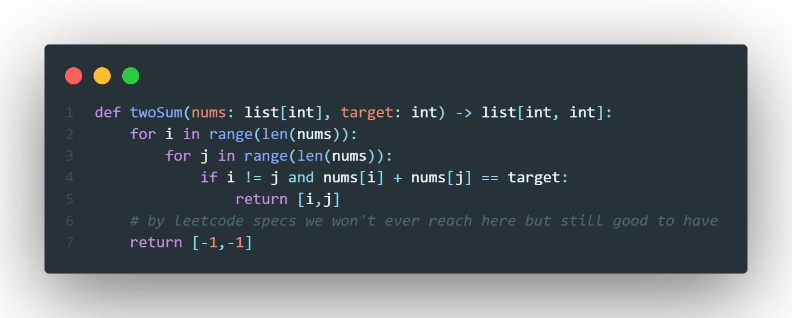
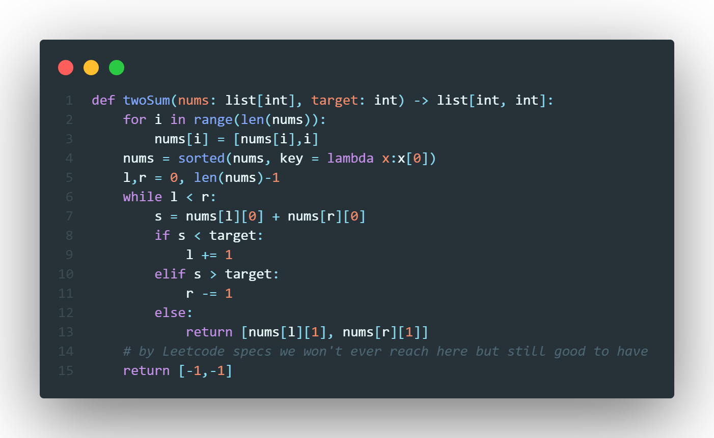
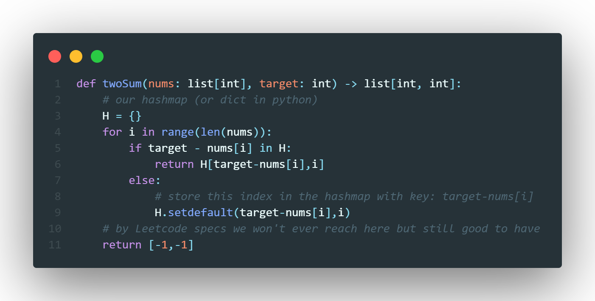

## Naive Approch
The first approach is for each number $n_i \in A$ where $A$ is our array of nums, we look at each $n_j, j \neq i$ and see if $n_i + n_j = t$ where $t$ is our target. If so then we return $(i,j)$, here is how we solve implement this in Python.

Since we checking $n-1$ numbers for each number, this gives us a time complexity of $\mathcal{O}(n^2)$ and this solution takes no extra space so constant space complexity. This approach will become slow as $n$ grow so we *must* optimise it.

## Sorting Approach (not entirely relevant for this problem)
The sorting approach uses the instrinsic properties of a sorted list. The idea is to first sort the list, and then have two pointers $l$ and $r$ which point to the start and end of the list respectively. \
Now we look at $A[l] + A[r]$, if this sum is greater than our target then move the right pointer one space left as this will yeild a smaller answer than before. And if the sum is less than the target then we move our left pointer right one space as this will make the sum greater then before. Finally, if the sum is exactly $t$ then we return $(l,r)$. Here is the implementation of this approach.

This approach is slightly faster than the previous approach as the most costly approach in our solution is sorting the list which takes $\mathcal{O}(n\log(n))$ time, the section where we traverse the list with a left and right pointer will take $\mathcal{O}(n)$ time hence, our solution has a time complexity of $\mathcal{O}(n\log(n))$ and depending on the languages might have constant space complexity. This is good, but we can do even better!

## HashMap Approach
HashMaps are an awesome data structure which can promise us constant lookup time (given a low *load factor* which you can always assume to be true when doing these questions). We can use the constant lookup time to our advantage, first remember that if we have two numbers such that $n_i + n_j =t$ then $t - n_j = n_i$, we can use this fact to our advantge. We will create a HashMap $H$ which starts off empty. Then we look at each number $n_i$ in the array, if $t - n_i \in H$ i.e. the difference between the target and the number are within our HashMap then that means that $(i, H(t-n_i))$ is our solution. $H(t-n_i)$ is the index of the number $t-n_i$. Below is the implementation

This is **the** optimal solution, since hashmaps promise us constant look up time then we only traverse the entire list once hence giving us $\mathcal{O}(n)$ time complexity, and we store at most $n$ number in the hashmap so we also have $\mathcal{O}(n)$ space complexity.