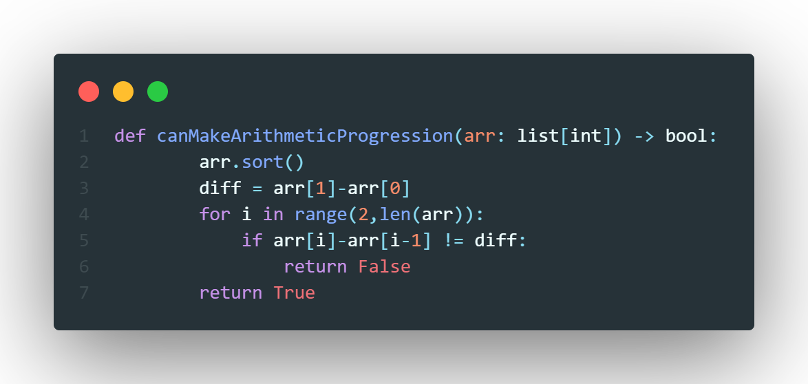

# Problem
> *Given an array of numbers `arr`, return `true` if the array can be rearranged to form an arithmetic progression. Otherwise, return `false`.*

## Difficulty: *Easy*

# Terminology
> **A sequence of numbers is called an arithmetic progression if the difference between any two consecutive elements is the same.**

# Solution
The information we are given in the *terminology* section allows us to form a base on how to solve this problem. We know that given two consecutive elemnts thier difference $d$ is the same same for each two consecutive elements. We also know that a sequence is **sorted**. These two facts almost solve the problem for us. First, we must sort the array, then we must find the difference between first two numbers, then for each number after the second number, check its diffrence with the number behind it, if the diffrence is different to the first calculated, then it is **not and arithmetic progression** and return `false`. Other wise return true.
# Code

# Analysis

## Time Complexity
The most costly operation here is sorting the list which takes $\mathcal{O}(n\log n)$ time hence our time complexity is:
$$
\mathcal{O}(n\log n)
$$

## Space Complexity
We do not create any other data strucutres to solve this problem hence we get a space complexity of:
$$
\mathcal{O}(1)
$$