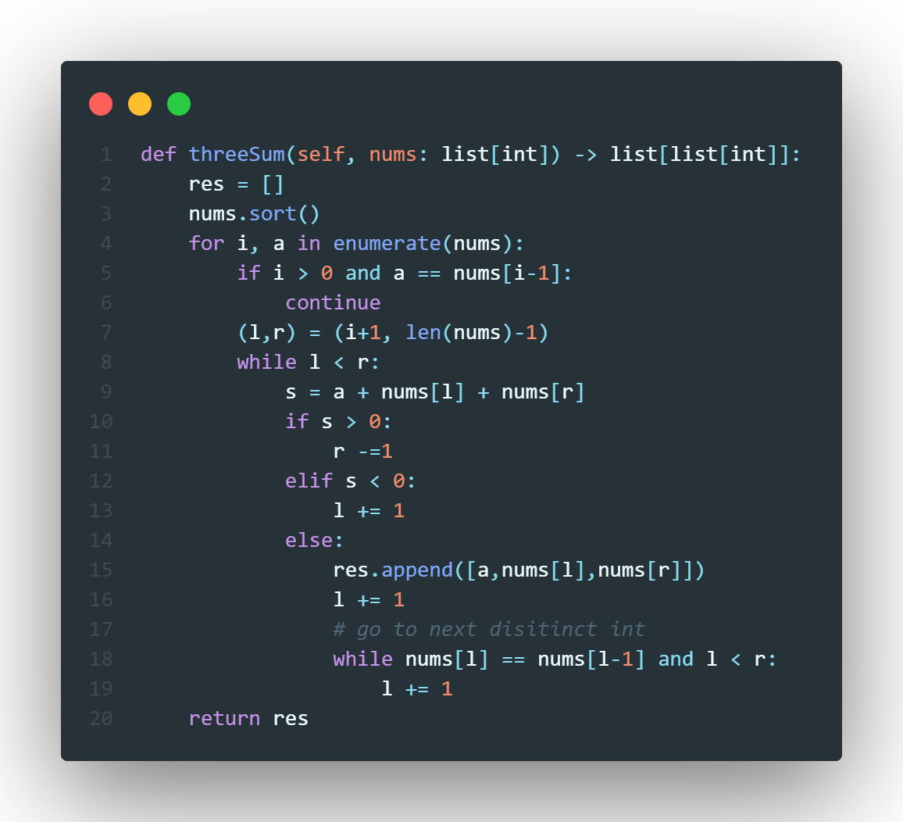

# Problem
Given an integer array nums, return all the triplets `[nums[i], nums[j], nums[k]]` such that `i != j`, `i != k`, and `j != k`, and `nums[i] + nums[j] + nums[k] == 0`.

*Notice that the solution set must not contain duplicate triplets.*

## Difficulty: *Medium*

# Solution
We can solve this question in a similar manner the *sorted approach for 2Sum*. That is, we sort the list of numbers first and then for each $n_i \in N$ we look at the subarray $[n_{i+1}, n_{|N|-1}]$ which is all the numbers that come after $n_i$. We do this in order to utilse the properties of a sorted list which is that if we two numbers $n_j,n_k$ where $k > j$ then 
$$n_j + n_{k-1} < n_j + n_{k} < n_j + n_{k+1}$$
which will allow us to find a triple (if it exists) is linear time for each number $n_i$ where $i < j$

We can does this as so: create a left pointer $l$ starting at index $i+1$ and a right pointer $r$ at index $|N|-1$. then we look at $n_i + n_l + n_r$, if this sum is less than our target then or value at the left pointer is too small hence we increase the pointer's index by $1$, if the sum is greater than the target then the value at the right pointer is too big hence we decrease the right pointer's index by $1$, finnaly if the sum is equal to the target then we append the tuple $(n_i, n_l, n_r)$ to our result array `res` Then we will increase our left pointer $l$ until it is on a distinct integer that isn't the same as $n_l$. Once we have finished looping trough the array we can return our resultant array `res`.

\pagebreak
# Code

## Time Complexity
Since for each $n_i$ we look at the subarray $[n_{i+1}, n_{|N|-1}]$ this has a cost of $n^2$ which gives us a time complexity of 
$$\mathcal{O}(n^2)$$

## Space Complexity
Our resultant list will contain $n$ tuples of length $3$ hence our space complexity is 
$$\mathcal{O}(n)$$
