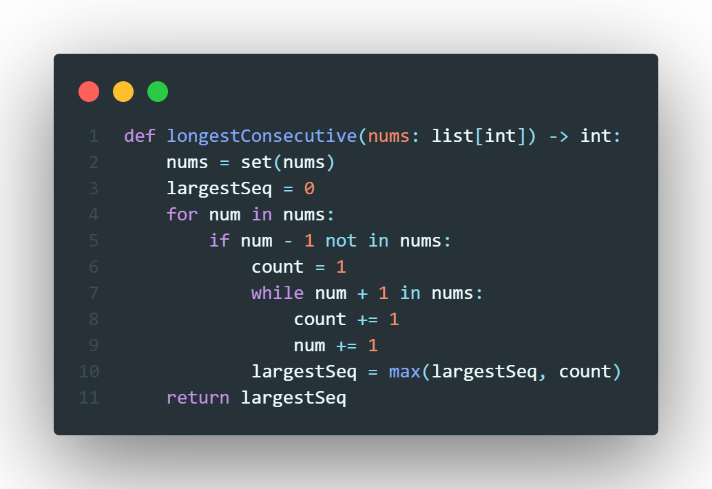

# Problem
> *Given an unsorted array of integers nums, return the length of the longest consecutive elements sequence.*\
> *You must write an algorithm that runs in O(n) time.*

# Solution
To solve this, we want to understand what makes a number **the start of a sequence?**. With the given information of the problem, a number $n \in N_A$ where $N_A$ is our array of numbers, is the start if a sequence $s$ if and only if $n-1 \not \in N_A$. We can use this to find the length of the longest increasing sequence. For each number $n$ we will check to see if it is the start of a sequence using the aforementioned invariant, if it is the start of a sequence, check to see if $n+1$ is also apart of our array of numbers, if so then add one to a counter. Keep adding one to both the current number and the counter until $n +1 \not \in N_A$. Then compare this count to the current maximum count and the larger the new maximum. This will indeed work, however it will give us a time complexity of $\mathcal{O}(n^2)$ since searching in an array takes $\mathcal{O}(n)$ time. But a simple trick will make our algorthim linear, by simply transforming the array of numbers into a **set** of numbers, we get $\mathcal{O}(1)$ lookup which then reduced our time complexity to $\mathcal{O}(n)$, but since we tranforms the array of numbers to a set of numbers ($N_A \to N_S$) this gives us $\mathcal{O}(n)$ space as well. The code is shown below.

