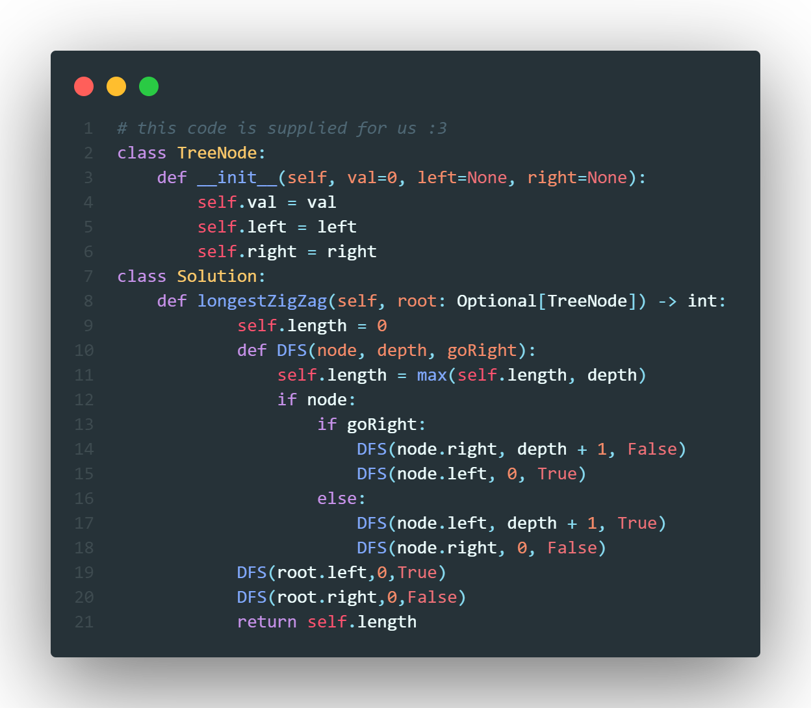

# Problem
You are given the `root` of a binary tree.

A ZigZag path for a binary tree is defined as follow:

Choose any node in the binary tree and a direction (right or left).

- If the current direction is right, move to the right child of the current node; otherwise, move to the left child.
- Change the direction from right to left or from left to right.
- Repeat the second and third steps until you can't move in the tree.

Return the longest ZigZag path contained in that tree

## Difficulty: *Medium*
 
# Terminology
**Zigzag length is defined as the number of nodes visited - 1. (A single node has a length of 0).**

# Solution
> *Heads up, this question might be a little tricky to understand, I know I found this really hard so reach out to me if you need clarification on anything!*

If we are going to want to find the longest zig-zag path in a binary tree, we will need to traverse in a zig-zag pattern. To do so we can create a helper function called `DFS` which takes the parameters `node`, `depth`, and `goRight`. `node` is simply the node we are at in the binary tree, `depth` is a counter for how deep we are in the tree and `goRight` is a flag variable to tell us if we need to go right this iteration or not. So how does this functio work? Well what it does is it will first comapre the current maxiumum depth with the depth traversed so far, the larger becoming thr maxiumum depth. Then we check to see if the node we are at is a node at all, if it is then we check the `goRight` attribute, if `true` (i.e. we need to go right) then we call `DFS` again for `node.right` (the right node), `depth+1` (since we are maintating the zigzag pattern we add to the depth) and `false` (since we went right this time we go left next time). We also make another call to `DFS` as `DFS(node.left,0,True)` Because the left node could contain a sub-tree with the largest zigzag pattern. if `goRight = false` then we do the same thing as before except we reverse `node.left` and `node.right`.

\pagebreak
# Code

# Analysis

## Time Complexity
This code will look at all nodes in the binary tree, since there are $n$ node we get:

$$ \mathcal{O}(n) $$

## Space Complexity
We create so extra space in our solution, hence:

$$ \mathcal{O}(1) $$