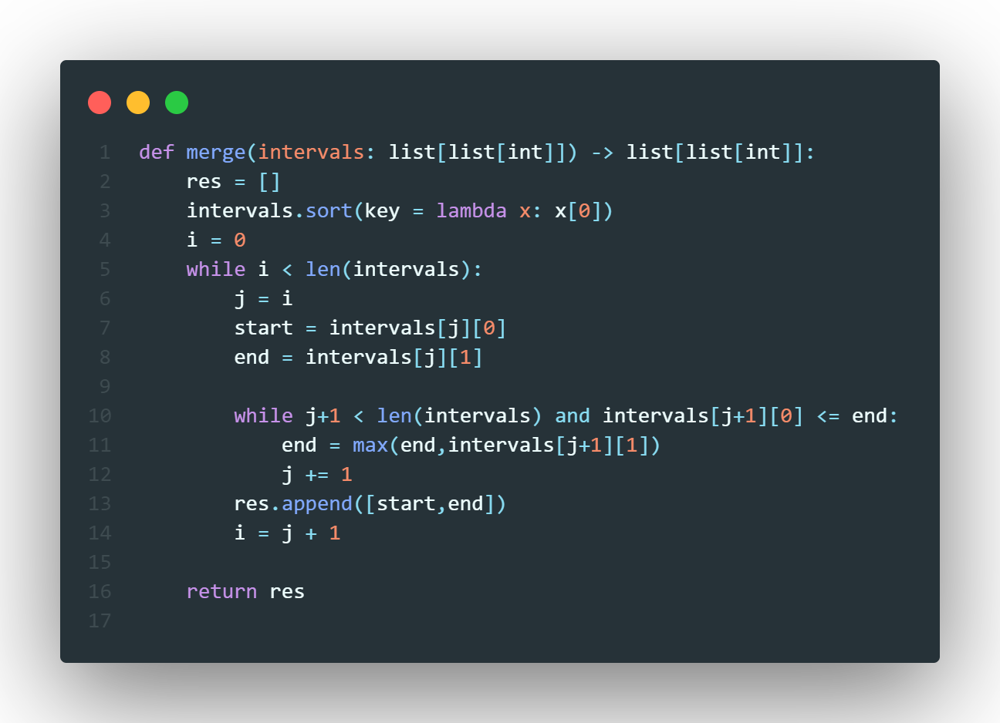

# Problem
Given an array of `intervals` where $\text{intervals}[i] = [\text{start}_i, \text{end}_i]$, merge all overlapping intervals, and return an array of the non-overlapping intervals that cover all the intervals in the input

## Difficulty: *Medium*

# Solution
First, we need to understand what an *overlapping interval* is. Am interval $I_i$ will overlap with interval $I_j$ if and only $I_i[end] \leqslant I_j[start]$ i.e., interval $I_i$ will end when or after $I_j$ starts. Now for each interval $I_i$ we need to merge all intervals that overlap with it, if we simply search for each interval where $end_i \leqslant start_j$ we would have quadratic complexity, we want to merge as many intervals possible using the least amount of time. We can do this by sorting the array of intervals by their starting time. Then for each interval we simply look at the next interval and check if it overlaps current end time we continue to look to the next interval until we are either reached the end of the array, or the next interval does not overlap in which case we append the start and end time to a resultant list.

\pagebreak
# Code

# Analysis

## Time Complexity
Sorting the list will take $n\log n$ operations, and looping through the intervals will take $n$ operations, hence we have a timecomplexity of 
$$\mathcal{O}(n\log(n))$$

## Space Complexity
We create a resultant array which will contain at most $n$ intervals hence we have a space complexity of 
$$\mathcal{O}(n)$$
